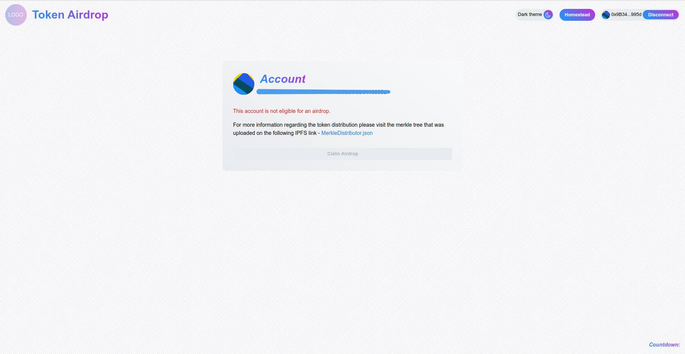

# How to run

## Airdrop Addresses

1. Find the addresses that are eligible for an airdrop based on a certain criteria
2. Extract the addresses into a json format
3. Check the json format required by Uniswap/merkle-distributor

## Using Uniswap merkle-distributor:

1. `cd merkle-distributor`
2. `yarn install`
3. Replace the content of the example.json with your own distribution content
4. `yarn generate-merkle-root:example`
5. Publish the generated output to IPFS

## Build and deploy the UI

1. `yarn install`
2. Replace the content of merkleTree.json under the `./src/constants/merkleTree.json` with the merkle generated by Uniswap/merkle-distributor scripts
3. Set `REACT_APP` env variables
4. `yarn start`
# token-airdrop

